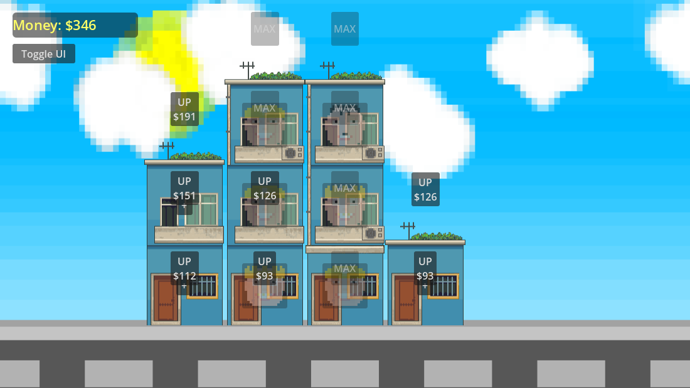

# 🏢 Tenant Tycoon

### Apartment Management & Social Simulation Game

  
  

---

<strong>🏠 About the Game</strong>

 

**Tenant-Tycoon** is a **landlord management & social simulation game** where you build apartment blocks, rent rooms to tenants, and deal with the chaos of human behavior.

Every month brings:

* New tenants 👥
* New problems 😬
* New opportunities to grow 💸

Money matters — but **relationships matter more**.

---

<strong>💼 Core Features</strong>

 

### 🏗 Apartment Building

* Build apartments floor by floor
* Expand left and right as your empire grows
* Upgrade rooms and buildings

### 👤 Tenants & Personalities

* Different tenant types (workers, artists, rich, etc.)
* Each tenant generates income 💰
* Personality clashes can cause conflicts ⚠️

### 🔥 Neighbor Relationships

* Good neighbors = bonuses
* Bad neighbors = chaos, complaints, lost income
* Decide who stays and who gets kicked out

### 📈 Tycoon Economy

* Dynamic build & upgrade costs
* Income scaling with room levels
* Strategic expansion decisions

---

<strong>🛠 Tech Overview</strong>

 

* **Engine:** Godot 4.x
* **Language:** GDScript
* **Rendering:** TileMap-based 2D world
* **UI:** Dynamic world-space UI buttons
* **Architecture:** Modular, data-driven systems

Designed to be expandable and moddable.

---

<strong>🚧 Development Status</strong>

 

* ✅ Building & floor system
* ✅ Economy & income generation
* ✅ Room upgrades & levels
* ✅ Tenant assignment
* 🚧 Tenant relationships & conflicts
* 🚧 Events & random problems
* 🚧 Polishing UI & feedback

The game is actively evolving — expect changes.

---

<strong>📸 Media</strong>

 

Coming soon:

* Gameplay screenshots
* Apartment growth GIFs
* Tenant conflict previews

---

<strong>🤝 Contributing</strong>

 

Ideas, feedback, and contributions are welcome:

* Bug reports 🐛
* Balance suggestions ⚖️
* Feature ideas 💡

Feel free to open an issue or discussion.

---

<strong>📬 Contact</strong>

 

* **GitHub:** https://github.com/ArmanKianian
* **Email:** Wastted@proton.me  

---

<strong>⭐ Support</strong>

 

If you like the project:

* ⭐ Star the repository
* 👀 Watch for updates

It helps a lot ❤️

